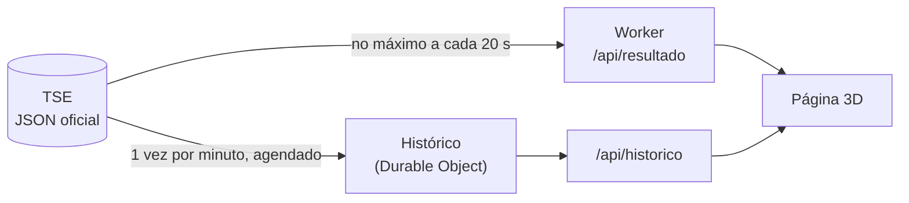

<div align="center">

# 🏃 Corrida para a Presidência · 2º turno

**A apuração do 2º turno das eleições presidenciais de 2026 como uma prova de atletismo em 3D.**

Dois corredores, uma volta na pista = 100% das urnas apuradas.
Todos os números vêm da divulgação oficial do TSE.

[](https://developers.cloudflare.com/workers/)
[](https://threejs.org/)
[](https://resultados.tse.jus.br)

**🌐 [corridaparapresidencia.eleicoes.workers.dev](https://corridaparapresidencia.eleicoes.workers.dev)**


</div>

---

> Versão do **2º turno (25/10/2026)**. A versão do 1º turno está preservada em
> [celibertojr/corrida-para-presidencia](https://github.com/celibertojr/corrida-para-presidencia).

## ✨ O que há de novo

| Recurso | O que faz |
|---|---|
| **2º turno** | Lula (13, PT) e Flávio Bolsonaro (22, PL) nas raias do meio de uma pista de 8 raias. A análise diz quando a vitória está *garantida* pelos números, quando há *tendência* e quando a disputa segue aberta. |
| **Diferença de votos** | O placar mostra a diferença entre o 1º e o 2º, em votos e em pontos percentuais. |
| **Estatísticas** | Botão com urnas apuradas, ritmo da apuração e previsão de 100% (estimativas), votos de cada candidato, diferença, trocas de liderança, comparecimento, abstenção, válidos, brancos e nulos. |
| **Gráfico minuto a minuto** | Botão com a evolução do % de votos válidos de cada candidato e da diferença entre eles, desde as 17h, com tabela e dica ao passar o mouse. |
| **Histórico no servidor** | A cada minuto o próprio servidor consulta o TSE e grava um ponto (o TSE só mantém o arquivo mais recente). Funciona mesmo sem ninguém com o site aberto. |
| **Modo leve** | Para computadores e celulares mais lentos: menos resolução, sem sombras, sem torcida, até 30 quadros/s. Liga sozinho se a página ficar lenta, pelo botão ou pelo endereço com `?leve=1`. |
| **Letreiro de notícias** | Faixa no pé da página, estilo canal de notícias, com os números do TSE passando em sequência: urnas apuradas, 1º e 2º colocados, diferença, cenário, comparecimento, abstenção, brancos, nulos e ritmo (estimativa). Antes da apuração, mostra a data e a contagem regressiva. Para ao passar o mouse (no computador) e tem botão de pausa; quem prefere menos movimento no sistema vê uma notícia por vez. |
| **Painel de controle** | O programa em Python (`painel/`) também foi atualizado: 2º turno, diferença de votos e janela com o gráfico. |

## 📏 Regras da corrida

| Regra | Como funciona |
|---|---|
| **Uma volta = 100% das urnas** | O líder fica na posição igual à porcentagem de urnas apuradas. |
| **Posição do 2º** | Proporcional aos votos: `posição = % apurada × votos do 2º ÷ votos do 1º`. |
| **Vitória garantida** | Quando a diferença supera todos os eleitores das seções ainda não apuradas. |
| **Tendência** | Quando a diferença supera o dobro dos votos válidos esperados no ritmo atual. |
| **Eleito** | Assim que o arquivo oficial do TSE marca um candidato como eleito (o que pode acontecer antes de 100%, quando o resultado fica matematicamente definido), o site mostra "eleito, segundo o TSE". Com 100% e sem essa marca, mostra "mais votado". |
| **Empate** | Votos iguais aparecem como empate: ninguém "lidera" e o pódio não é liberado. |
| **Cena do pódio** | O 1º colocado comemora com os braços para cima e a faixa presidencial verde e amarela; o 2º fica triste, de cabeça baixa e braços caídos. Atrás, uma torcida pula com bandeiras na cor do partido de quem venceu. Vale igual para os dois candidatos. |
| **Botão "Vencedores"** | Pódio 3D liberado quando o TSE declara o eleito, ou acima de 99% das urnas (só com 99,99% se a diferença estiver dentro da margem de incerteza). |
| **% de urnas** | Nunca arredonda para cima: 99,96% aparece como 99,96%, não 100,0%. Perto do início e do fim, com 2 casas, como o TSE. |

## 🧱 Como funciona



- **`public/index.html`**: o site inteiro (3D, interface, estatísticas, gráfico, letreiro, modo leve).
- **`public/three.min.js`**: Three.js r128 servido pelo próprio site (as CDNs ficam só de reserva).
- **`src/worker.js`**: lê o JSON do TSE, grava o histórico minuto a minuto e responde `/api/resultado`, `/api/historico`, `/api/status` e `/api/verificar`.
- **`wrangler.jsonc`**: configuração do Worker, incluindo o agendador (`* * * * *`), o armazenamento do histórico (Durable Object com SQLite, disponível no plano grátis) e os logs (*Workers → corridaparapresidencia → Logs*).
- **Cuidado com o TSE**: cada cópia do Worker guarda o último dado por 20 s e faz uma consulta por vez (os outros pedidos esperam a mesma resposta). Se o TSE recusar (403/429) ou falhar, o Worker espera antes de tentar de novo (de 30 s a 5 min, ou o tempo pedido pelo TSE) e, enquanto isso, serve o último dado bom marcado como "último dado". Cada consulta tem limite de 8 s.
- **Histórico**: só entram pontos a partir do início configurado (pontos de ensaio ficam de fora), e a tabela fica em memória no Durable Object (o plano grátis limita as linhas lidas por dia).
- **A corrida nunca anda para trás**: se chegar um dado mais velho que o já mostrado, a página mantém o atual como "último dado".
- **Antes de 25/10 às 17h**, nem a página nem o servidor consultam o TSE; a página mostra a contagem regressiva.

## 🔧 Variáveis do Worker

| Variável | Para que serve |
|---|---|
| `TSE_URL` | URL do JSON do TSE, se o tribunal usar outro caminho. Padrão: eleição **6258** (2º turno). |
| `TSE_START` | Início da divulgação (ISO 8601). Padrão: `2026-10-25T20:00:00Z` (17h de Brasília). |

`/api/status` mostra a URL e o horário em uso; `/api/verificar` lê o TSE na hora.

## 💻 Rodar localmente

```bash
npx wrangler dev --test-scheduled
# disparar o agendador manualmente:  curl "http://localhost:8787/__scheduled?cron=*+*+*+*+*"
```

## ⚠️ Aviso

Projeto **independente, sem qualquer vínculo com o Tribunal Superior Eleitoral (TSE)**, com candidatos ou partidos. Os números vêm da divulgação do TSE, mas podem ter atraso ou falhas, e as indicações de tendência são apenas estimativas. **Para saber quem foi eleito, use somente as fontes oficiais do TSE:** [resultados.tse.jus.br](https://resultados.tse.jus.br).

## 🤖 Feito com IA

Todo o código foi escrito por **inteligência artificial** (Claude, da Anthropic), a partir de pedidos e revisões feitos em conversa, como experimento do que dá para construir assim.

## 📚 Referências

- [TSE — Divulgação de Resultados](https://resultados.tse.jus.br)
- [Cloudflare Workers — Static Assets](https://developers.cloudflare.com/workers/static-assets/)
- [Cloudflare Workers — Cron Triggers](https://developers.cloudflare.com/workers/configuration/cron-triggers/)
- [Cloudflare Durable Objects — SQLite storage](https://developers.cloudflare.com/durable-objects/api/sqlite-storage-api/)
- [Three.js](https://threejs.org/)
